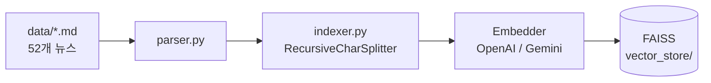
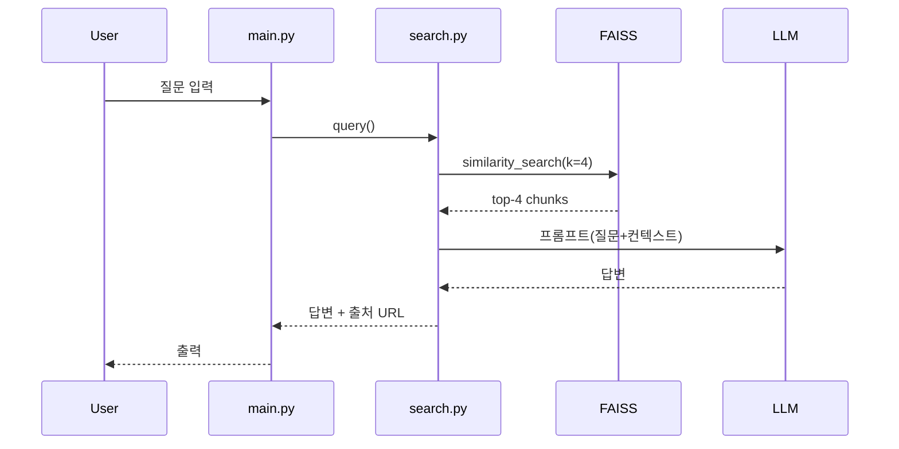

# AI-news-RAG 작업 대시보드

> **프로젝트**: 옵시디언에 모은 52개 한국어 AI 뉴스 md를 RAG로 검색·요약하는 개인용 도구
> **타임라인**: 3일 MVP (예산 ~23h)
> **차별점**: OpenAI vs Gemini 동일 파이프라인 비교 (정확도 + 속도 + 비용 + 노이즈)
> **최종 업데이트**: 2026-05-22

---

## 🧱 기술스택

| 영역 | 선택 | 비고 |
|---|---|---|
| 언어 | Python 3.11 | |
| 패키지 | `pip` + `venv` | `requirements.txt`로 관리 |
| RAG 프레임워크 | LangChain | `langchain`, `langchain-community` |
| 임베딩 (MVP) | OpenAI `text-embedding-3-small` | Gemini `text-embedding-004`로 갈아끼움 |
| LLM (MVP) | OpenAI `gpt-4o-mini` | Gemini `gemini-2.0-flash`로 갈아끼움 |
| Vector DB | FAISS (`faiss-cpu`) | 로컬, 메모리 기반 |
| 마크다운 파싱 | `python-frontmatter` | YAML frontmatter 파싱 |
| 환경변수 | `python-dotenv` | `.env` 로드 |
| 테스트 | `pytest` | 6~7개 단위/스모크 테스트 |
| 인터페이스 | CLI (stdin/stdout) | Streamlit은 v2 |

> 각 선택의 **배경/임팩트/대안비교/동작원리/사이드이펙트**는 `docs/decisions/`에 ADR 형식으로 분리 저장. 해당 Task 진행 시 채팅 설명 후 파일로 옮김.

---

## 📊 한눈에 보기

| # | Task | ⭐ | 예상 | 상태 | ADR |
|---|---|---|---|---|---|
| 01 | 폴더 셋업 & 인프라 | | 1.5h | 🟢 | — |
| 02 | API 키 발급 & `.env` 설계 | | 1h | 🟢 | — |
| 03 | 마크다운 파서 (`parser.py`) | | 2h | 🟢 | — |
| 04 | 청킹 전략 결정 | ⭐ | 3h | 🟢 | `002-chunking-strategy.md` |
| 05 | 임베딩 + Provider 추상화 | ⭐ | 2.5h | ⬜ | `003-embedding-provider.md` |
| 06 | FAISS 인덱싱 (`indexer.py`) | ⭐ | 2h | ⬜ | `004-vector-store-choice.md` |
| 07 | 검색 모듈 (`search.py`) | ⭐ | 2h | ⬜ | `005-retrieval-strategy.md` |
| 08 | 생성 + 프롬프트 | ⭐ | 2.5h | ⬜ | `006-prompt-design.md` |
| 09 | CLI (`main.py`) | | 1.5h | ⬜ | — |
| 10 | 테스트 마무리 + E2E 스모크 | | 1h | ⬜ | — |
| 11 | 평가 + Gemini 비교 | ⭐ | 3h | ⬜ | `007-evaluation-metrics.md` |
| 12 | README.md 작성 | | 1h | ⬜ | — |
| | **합계** | | **~23.5h** | | |

- ⭐ = 학습 5요소(배경/임팩트/대안비교/동작원리/사이드이펙트) 풀 적용
- ADR `001-tech-stack.md`는 Task 01에서 일괄 작성 (전체 기술스택 선택 근거)

---

## 🏗 아키텍처

**빌드 타임 (인덱싱 파이프라인)**


**런타임 (질의 흐름)**


---

## 📁 폴더 구조 (Task 01 산출물)

```
ai-news-rag/
├── data/                      # 52개 .md 뉴스 (news/에서 rename)
│   └── vector_store/          # FAISS 인덱스 (gitignore)
├── src/
│   ├── __init__.py
│   ├── parser.py              # md 파싱
│   ├── indexer.py             # 청킹 + 임베딩 + FAISS 저장
│   └── search.py              # 검색 + LLM 답변 생성
├── tests/
│   └── test_*.py              # pytest 6~7개
├── docs/
│   └── decisions/             # ADR (5요소 결정 기록)
│       ├── README.md          # 결정 인덱스
│       ├── 001-tech-stack.md
│       ├── 002-chunking-strategy.md
│       ├── ...
│       └── v2-backlog.md      # MVP 후 추가할 아이디어
├── main.py                    # CLI 진입점
├── requirements.txt
├── .env                       # gitignore
├── .env.example
├── .gitignore
├── DASHBOARD.md               # 이 파일
└── README.md                  # Task 12에서 작성
```

---

## 📌 운영 원칙

### 워크플로우 (절대 준수)
```
[1] 개발 → [2] 검수(피드백) → [3] 컨펌(유저 OK) → 다음 Task
```
유저의 명시적 컨펌 없이 다음 단계 진행 일체 금지.

### ⭐ Task 진행 절차
1. 채팅으로 5요소 설명 (배경/임팩트/대안비교/동작원리/사이드이펙트)
2. 유저 결정 → 컨펌
3. 코드 작성 + 해당 ADR 파일 생성 (`docs/decisions/`)
4. 결과 시연 (검수)
5. 유저 OK → 다음 Task

### 보안 가드레일
- 새 API 키 발급 시 명시: **이름 / 만료일 / 권한 범위**
- `.env` 표시 시 항상 마스킹 (`sk-****` 또는 `<YOUR_KEY_HERE>`)
- `.gitignore`에 `.env`, `data/vector_store/`, `__pycache__/` 필수

### 스코프 관리
- MVP 진행 중 새 아이디어 떠오르면 `docs/decisions/v2-backlog.md`에만 기록, 본 작업 계속 진행
- 추가 라운드/논의가 진전을 늦추는 게 보이면 Claude가 솔직히 알림

### 분산 테스트
- 각 모듈 Task(parser/chunking/indexer/search/generation)에서 해당 모듈 테스트(`tests/test_*.py`) 같이 작성
- Task 10은 누락 점검 + E2E 스모크만

### 상태 표기
⬜ 미착수 / 🟡 개발중 / 🔵 검수대기 / 🟢 컨펌완료 / 🔴 재작업

---

## 📅 일정

| Day | Tasks | 누적 시간 |
|---|---|---|
| Day 1 | T01 ~ T04 (셋업/파싱/청킹) | ~7.5h |
| Day 2 | T05 ~ T08 (임베딩/인덱싱/검색/생성) | ~9h |
| Day 3 | T09 ~ T12 (CLI/테스트/평가/README) | ~7h |

---

## 📋 Task 상세

### Task 01 — 폴더 셋업 & 인프라
`news/` → `data/` rename. `src/`, `tests/`, `docs/decisions/` 생성. 빈 파일: `__init__.py`, `parser.py`, `indexer.py`, `search.py`, `main.py`. `requirements.txt`, `.gitignore`, `.env.example`. ADR 인덱스 `docs/decisions/README.md` + `v2-backlog.md` 생성. ADR `001-tech-stack.md`도 이 단계에서 작성 (전체 스택 근거).
- [ ] 개발 → [ ] 검수 → [ ] 컨펌

### Task 02 — API 키 발급 & `.env` 설계
OpenAI + Gemini 키 발급 계획서 (**이름 / 만료일(+90일) / 권한 범위**) → `.env` 생성 (마스킹 표시만, 실제 값은 유저가 로컬에 입력).
- [ ] 개발 → [ ] 검수 → [ ] 컨펌

### Task 03 — 마크다운 파서 (`parser.py`)
`python-frontmatter`로 frontmatter(`title`/`source`/`published`) + 본문 분리, 이미지 마크다운(``) 제거, 52개 파일 전수 파싱 검증.
- [ ] 개발 → [ ] 검수 → [ ] 컨펌

### ⭐ Task 04 — 청킹 전략 → ADR `002-chunking-strategy.md`
5요소 설명 → chunk_size / overlap / separator 우선순위 결정 → `RecursiveCharacterTextSplitter` 구현 → 샘플 3개 청크 결과 시연.
- [ ] 5요소 설명 → [ ] 결정 컨펌 → [ ] 개발 → [ ] 검수 → [ ] 컨펌

### ⭐ Task 05 — 임베딩 + Provider 추상화 → ADR `003-embedding-provider.md`
5요소 설명 → `get_embedder(provider)` 인터페이스 설계 → OpenAI로 MVP 진행, Gemini 코드도 동시 작성 (테스트는 Task 11에서). **52개 임베딩 비용 추정치 출력 필수**.
- [ ] 5요소 설명 → [ ] 결정 컨펌 → [ ] 개발 → [ ] 검수 → [ ] 컨펌

### ⭐ Task 06 — FAISS 인덱싱 (`indexer.py`) → ADR `004-vector-store-choice.md`
5요소 설명 → 청크 + 임베딩 → FAISS 저장, 메타데이터(`title`/`source`/`published`) 보존 → `data/vector_store/`에 영속화. **임베딩 캐시**(해시 기반 재실행 시 재임베딩 방지).
- [ ] 5요소 설명 → [ ] 결정 컨펌 → [ ] 개발 → [ ] 검수 → [ ] 컨펌

### ⭐ Task 07 — 검색 모듈 → ADR `005-retrieval-strategy.md`
5요소 설명 → `similarity_search(query, k=4)` 구현, top-4 청크 + 메타데이터 반환 → 5종 테스트 쿼리 결과 시연.
- [ ] 5요소 설명 → [ ] 결정 컨펌 → [ ] 개발 → [ ] 검수 → [ ] 컨펌

### ⭐ Task 08 — 생성 + 프롬프트 → ADR `006-prompt-design.md`
5요소 설명 → `get_llm(provider)` 추상화 → 시스템 프롬프트(한국어/사실기반/출처인용강제/환각방지) → 답변 포맷에 URL 인용 → 3종 답변 검수.
- [ ] 5요소 설명 → [ ] 결정 컨펌 → [ ] 개발 → [ ] 검수 → [ ] 컨펌

### Task 09 — CLI (`main.py`)
`python main.py build` (인덱싱 실행) + `python main.py chat` (대화형 질의). E2E 데모 (질문 → 답변 시연).
- [ ] 개발 → [ ] 검수 → [ ] 컨펌

### Task 10 — 테스트 마무리 + E2E 스모크
**분산 테스트 정책**: 각 모듈 Task(03/04/06/07/08)에서 해당 모듈의 `tests/test_*.py`를 같이 작성.
Task 10에서는 누락 점검 + 빌드→검색→답변 E2E 스모크 1건 추가.

분산 작성 예상:
- Task 03: `test_parser.py` (metadata 추출 / 52개 파싱) ✅ 작성됨
- Task 04: `test_chunking.py` (비공백 청크)
- Task 06: `test_indexer.py` (FAISS save/load roundtrip)
- Task 07: `test_search.py` (top-k 반환 / 메타데이터 보존)
- Task 08: `test_answer.py` (답변에 URL 포함)
- **Task 10**: 누락 점검 + `test_e2e_smoke.py` (build → query → answer 1건)

- [ ] 누락 점검 → [ ] E2E 스모크 → [ ] 검수 → [ ] 컨펌

### ⭐ Task 11 — 평가 + Gemini 비교 → ADR `007-evaluation-metrics.md`
1. 테스트 질문 10개 작성 (정답있음 7 + 환각테스트 3) — 유저 컨펌 필수
2. `time.time()` + 토큰 로깅 추가 (Latency / Tokens / Cost)
3. OpenAI로 10문항 실행 → 결과 저장
4. Gemini로 갈아끼워 10문항 실행 → 결과 저장
5. 채점지: 정확도(1-5) / Context Noise(노이즈청크/4) / Citation 일치 / Latency / Tokens / 비용
6. 결과 표 + 결론 작성 (Task 12 README에 사용)
- [ ] 10문항 컨펌 → [ ] 자동 로깅 구현 → [ ] OpenAI 실행 → [ ] Gemini 실행 → [ ] 수동 채점 → [ ] 결론 → [ ] 컨펌

### Task 12 — README.md 작성
Problem → Solution → 아키텍처(Mermaid 재사용) → 사용법 → 평가 결과(Task 11) → 한계 / v2 계획(`v2-backlog.md` 링크) → `docs/decisions/` 링크 (Engineering Decisions 섹션).
- [ ] 개발 → [ ] 검수 → [ ] 컨펌

---

## 🚦 진행 안내

- 각 Task는 위 절차대로 진행. 자동 진행 일체 없음.
- **다음 Task 시작은 "Task NN 컨펌, 다음 진행" 발화 필요.**
- Claude는 매 Task 종료 시 컨펌 대기. 컨펌 없이 다음 코드 작성 금지.
