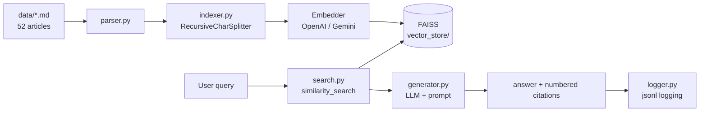

# AI-news-RAG

> A Korean AI-news RAG system — *"an AI news assistant I built for myself to actually read."*

🇰🇷 [한국어](README.md) | 🇬🇧 English


---

## Problem

Too much AI news to read daily. General LLMs hallucinate on recent events and don't cite sources.

## Solution

RAG over Korean AI-news markdown collected via Obsidian (MVP: 52 articles). **Every answer sentence cites its source**; if there's no grounding, the system refuses ("no relevant info") instead of hallucinating.

## What makes it different

- **Controlled ChatGPT vs Gemini comparison** — same retrieval, same temperature, only the LLM varies → accuracy / cost / latency / citation fidelity measured ([results ↓](#-evaluation-chatgpt-vs-gemini))
- **Provider abstraction** — swap among 3 embedders × 2 LLMs with a single argument
- **Engineering Decisions (ADRs)** — every decision recorded with 5 elements (context / impact / alternatives / mechanics / side-effects) + reasoning journey → [`docs/decisions/`](docs/decisions/)
- **Anti-hallucination design** — refuse when ungrounded, enforce numbered citations (while honestly documenting prompt-only limits)

## 🖥 Demo

**① Question with data → answer + citations**
```
> What's OpenAI been up to lately?

OpenAI is strengthening AI-image provenance by adopting the
C2PA standard and Google's "SynthID" watermarking [1].
It also announced a "Guaranteed Capacity" program letting
enterprises lock in compute via long-term contracts [2][4].

📎 Sources:
  [1] OpenAI doubles down on AI-image detection... C2PA + Google SynthID
  [2] OpenAI unveils enterprise "Guaranteed Capacity" program...
```

**② Question without data → refuses instead of hallucinating**
```
> Give me a kimchi fried rice recipe

No relevant information found in the provided news data.
```
→ It won't make things up; when it answers, **every sentence carries a `[number]` source** for traceability.

## Architecture



## Stack

Python 3.11 / LangChain 0.3 / FAISS / OpenAI (gpt-4o-mini, text-embedding-3) + Google Gemini (2.5-flash, embedding) / pytest

Rationale → [ADR 001: tech-stack](docs/decisions/001-tech-stack.md)

---

## 📊 Evaluation (ChatGPT vs Gemini)

> **TL;DR:** Accuracy & citation fidelity → **Gemini**; speed, cost & conciseness → **ChatGPT**. If the goal is *quick skimming*, ChatGPT fits better. Both refuse hallucination perfectly.

> **Controlled design:** embedder fixed (openai-small) + temperature fixed (0) → **only the LLM varies**. [Golden Dataset](eval/golden_dataset.json) of 11 questions (8 answerable + 3 hallucination traps). Automatic metrics + manual scoring.
> *(controlled design = hold everything constant except one variable, so any difference is attributable to the LLM)*

| Metric | ChatGPT (gpt-4o-mini) | Gemini (gemini-2.5-flash) | Winner |
|---|---|---|---|
| Avg accuracy (manual, 1-5) | 3.94 | **4.5** | Gemini |
| Recall@k (retrieval) | 0.958 | 0.958 | tie* |
| Refusal accuracy (anti-halluc.) | 1.0 | 1.0 | tie |
| Citation coverage | 0.55 | **1.0** | Gemini |
| Avg latency | **3.4s** | 5.2s | ChatGPT |
| Cost (11 questions) | **$0.0033** | $0.0114 | ChatGPT (3.4× cheaper) |
| Avg output tokens | **114** | 225 | ChatGPT (concise) |

<sub>*Same embedder → identical retrieval = controlled design verified; only the LLM difference is measured.</sub>

<sub>**Terms:** **Recall@k** = fraction of expected articles appearing in the top-k retrieval · **Citation coverage** = fraction of answer sentences that carry a source · **Refusal accuracy** = fraction of hallucination traps correctly refused.</sub>

**Conclusion:** Gemini leads on average accuracy and citation fidelity, but for the project's actual goal — *fast digestion* — ChatGPT's brevity, lower cost, and speed fit better. *"Fit for purpose" matters more than "objectively better."* A **reversal** also appeared on sparse/partial-info questions (e.g. an entity mentioned only in passing), where Gemini over-narrowed and ChatGPT won.

**Honest caveats:** ① tier mismatch (gemini-2.5-flash is a newer generation than gpt-4o-mini) ② single-rater manual scoring ③ 11-question sample ④ citations verified at article-level only (not claim-level). → Scores are indicative; same-generation & expanded evaluation are v2.

📄 **Full methodology / per-question scores / reasoning journey → [ADR 007: evaluation-metrics](docs/decisions/007-evaluation-metrics.md)**

---

## Getting started

```bash
# 1. Install deps
python3.11 -m venv .venv && source .venv/bin/activate
pip install -r requirements.txt

# 2. API keys (real keys go in .env)
cp .env.example .env
# edit .env → OPENAI_API_KEY, GOOGLE_API_KEY

# 3. Prepare data (collected separately for copyright — data/*.md, see data/README.md)

# 4. Build index
python main.py build                 # openai-small
python main.py build --all           # all 3 providers

# 5. Interactive chat
python main.py chat                  # ChatGPT pipeline
python main.py chat --llm gemini     # answer with Gemini

# 6. Run evaluation (optional)
python -m eval.evaluate              # Golden Dataset 11 questions × 2 combos

# Tests (no API calls, fake models)
pytest -q
```

## Limitations / v2 roadmap

MVP is **precision-first** (refuse over confident-but-wrong) + **single source (AItimes)** + **dense retrieval only**. Known limits:
- Keyword bleed (same-company-different-topic articles pulled in), duplicate chunks from one article, weak on negation/temporal queries → **structural limits of dense embeddings**
- Prompt-only grounding can't fully prevent citation laundering

v2 priorities (by ROI): **MMR → Query Rewriting → Hybrid (BM25 + Kiwi) → Re-ranking** + answer-mode selection (quick / deep) + Golden Dataset expansion + **multi-platform parser (Strategy Pattern, auto-routing by source domain)**.
→ details: [v2 backlog](docs/decisions/v2-backlog.md)

## Engineering Decisions (ADRs)

| # | Decision |
|---|---|
| [001](docs/decisions/001-tech-stack.md) | Tech stack |
| [002](docs/decisions/002-chunking-strategy.md) | Chunking strategy |
| [003](docs/decisions/003-embedding-provider.md) | Embedding provider abstraction |
| [004](docs/decisions/004-vector-store-indexing.md) | FAISS indexing + cache |
| [005](docs/decisions/005-retrieval-strategy.md) | Retrieval strategy (rank-only, k=4) |
| [006](docs/decisions/006-prompt-design.md) | Prompt design (anti-hallucination, numbered citations) |
| [007](docs/decisions/007-evaluation-metrics.md) | Evaluation methodology + ChatGPT vs Gemini |

Full progress log → [DASHBOARD.md](DASHBOARD.md)

## Data

`data/*.md` are copyrighted works of an external outlet (AItimes), so they're excluded from git (`.gitignore`). See [data/README.md](data/README.md).

## License

Code: MIT (planned) / Data: original copyright holders
