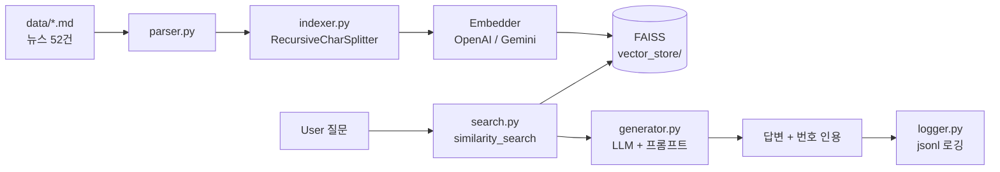

# AI-news-RAG

> 한국어 AI 뉴스 RAG 시스템 — *"내가 읽으려고 만든 AI 뉴스 비서"*

🇰🇷 한국어 | 🇬🇧 [English](README.en.md)


---

## 문제

매일 쏟아지는 AI 뉴스를 정독할 시간이 없음. 일반 LLM은 최신 정보에 할루시네이션 + 출처 불명확.

## 해결

옵시디언으로 수집한 한국어 AI 뉴스 마크다운(MVP: 52건)을 RAG로 검색·요약. **답변 문장마다 원본 출처 인용**, 근거 없으면 "정보 없음" 거부 → 환각 방지.

## 차별점

- **ChatGPT vs Gemini 통제 비교** — 같은 검색결과·같은 temperature로 LLM만 바꿔 정확도·비용·속도·인용 충실도 정량 측정 ([결과 ↓](#-평가-결과-chatgpt-vs-gemini))
- **Provider 추상화** — 임베더 3종 × LLM 2종 조합을 인자 하나로 교체
- **Engineering Decisions (ADR)** — 모든 결정에 배경/임팩트/대안비교/동작원리/사이드이펙트 5요소 + 사고 과정 기록 → [`docs/decisions/`](docs/decisions/)
- **환각 방지 설계** — 근거 부족 시 거부, 번호 인용 강제 (단, prompt-only의 한계도 정직하게 문서화)

## 🖥 데모

**① 데이터에 있는 질문 → 답변 + 출처 인용**
```
질문> 오픈AI 최근 동향은?

오픈AI는 AI 생성 콘텐츠 식별을 강화하기 위해 국제 표준 C2PA와
구글의 워터마킹 기술 '신스ID'를 적용하기로 했습니다 [1].
또한 기업용 '보장형 용량' 프로그램을 발표해, 장기 계약으로
컴퓨팅 자원을 안정적으로 확보할 수 있게 했습니다 [2][4].

📎 출처:
  [1] 오픈AI, AI 이미지 식별 2중 강화...C2PA 표준에 구글 '신스ID' 더했다.
  [2] 오픈AI, 기업용 '보장형 용량' 프로그램 공개…"컴퓨팅 자원 안정 공급"
```

**② 데이터에 없는 질문 → 환각 대신 거부**
```
질문> 김치볶음밥 레시피 알려줘

제공된 뉴스 데이터에서 관련 정보를 찾지 못했습니다.
```
→ 모르는 건 지어내지 않고 솔직히 거부. 답할 땐 **문장마다 `[번호]` 출처**를 달아 추적 가능.

## 아키텍처



## 기술스택

Python 3.11 / LangChain 0.3 / FAISS / OpenAI(gpt-4o-mini, text-embedding-3) + Google Gemini(2.5-flash, embedding) / pytest

선택 근거 → [ADR 001: tech-stack](docs/decisions/001-tech-stack.md)

---

## 📊 평가 결과 (ChatGPT vs Gemini)

> **한 줄 결론:** 정확도·인용 충실도는 **Gemini**, 속도·비용·간결함은 **ChatGPT**. "빠른 소화"가 목적이면 ChatGPT가 더 맞다. 둘 다 환각은 완벽히 거부.

> **통제 설계:** 임베더 고정(openai-small) + temperature 고정(0) → **LLM만** 비교. [Golden Dataset](eval/golden_dataset.json) 11문항(답있음 8 + 환각 3). 자동 지표 + 수동 채점.
> *(통제 설계 = 비교할 변수 1개만 남기고 나머지 고정 → 차이의 원인을 LLM으로 특정)*

| 지표 | ChatGPT (gpt-4o-mini) | Gemini (gemini-2.5-flash) | 우세 |
|---|---|---|---|
| 평균 정확도 (수동 1-5) | 3.94 | **4.5** | Gemini |
| Recall@k (검색) | 0.958 | 0.958 | 동일* |
| 거부 정확도 (환각 방지) | 1.0 | 1.0 | 동일 |
| Citation coverage | 0.55 | **1.0** | Gemini |
| 평균 Latency | **3.4s** | 5.2s | ChatGPT |
| 비용 (11문항) | **$0.0033** | $0.0114 | ChatGPT (3.4배 저렴) |
| 평균 출력 토큰 | **114** | 225 | ChatGPT (간결) |

<sub>*같은 임베더 → 검색 결과 동일 = 통제 설계 검증됨. LLM 차이만 순수 측정.</sub>

<sub>**용어:** **Recall@k** = 정답 기사가 검색 top-k에 들어온 비율(검색이 옳은 걸 가져왔나) · **Citation coverage** = 답변 문장 중 출처가 달린 비율(근거 표시율) · **거부 정확도** = 환각테스트에 "정보 없음"으로 정확히 거부한 비율.</sub>

**결론:** Gemini가 평균 정확도·인용 충실도 우세. 단 **빠른 소화가 목적이면** ChatGPT의 간결함·저비용·속도가 더 적합 — *"객관적 우열"보다 "제품 목적 적합성"이 기준.* 또한 희박/부분정보 질문(예: 부차적으로 언급된 엔티티)에선 Gemini가 과도하게 좁게 해석해 ChatGPT가 우세한 **역전**도 관측됨.

**정직한 한계:** ① 체급 불일치(gemini-2.5-flash가 gpt-4o-mini보다 신세대) ② 1인 수동 채점 ③ 11문항 샘플 ④ citation은 article-level만 검증(claim-level 미검증). → 점수는 참고치, 동세대·확장 평가는 v2.

📄 **전체 방법론 / 문항별 점수 / 사고 과정 → [ADR 007: evaluation-metrics](docs/decisions/007-evaluation-metrics.md)**

---

## 시작하기

```bash
# 1. 의존성 설치
python3.11 -m venv .venv && source .venv/bin/activate
pip install -r requirements.txt

# 2. API 키 설정 (실제 키는 .env에)
cp .env.example .env
# .env 열어 OPENAI_API_KEY, GOOGLE_API_KEY 입력

# 3. 데이터 준비 (저작권상 별도 수집 — data/*.md, 자세한 건 data/README.md)

# 4. 인덱스 빌드
python main.py build                 # openai-small
python main.py build --all           # 3 provider 모두

# 5. 대화형 챗봇
python main.py chat                  # ChatGPT 파이프라인
python main.py chat --llm gemini     # Gemini로 답변

# 6. 평가 실행 (선택)
python -m eval.evaluate              # Golden Dataset 11문항 × 2조합

# 테스트 (API 호출 없음, Fake 모델)
pytest -q
```

## 한계 / v2 계획

MVP는 **precision-first**(틀린 자신감보다 거부) + **단일 소스(AItimes)** + **Dense 검색만**. 알려진 한계:
- 키워드 블리드(같은 회사 다른 주제 기사 딸려옴), 같은 기사 중복 청크, 부정/시간 표현 약함 → **Dense 임베딩 구조적 한계**
- prompt-only grounding은 citation laundering 완전 차단 못 함

v2 우선순위 (ROI 순): **MMR → Query Rewriting → Hybrid(BM25+Kiwi) → Re-ranking** + 답변 모드 선택(빠른/깊은) + Golden Dataset 확장 + 다중 포털 파서.
→ 상세: [v2 백로그](docs/decisions/v2-backlog.md)

## Engineering Decisions (ADR)

| # | 결정 |
|---|---|
| [001](docs/decisions/001-tech-stack.md) | 기술스택 |
| [002](docs/decisions/002-chunking-strategy.md) | 청킹 전략 |
| [003](docs/decisions/003-embedding-provider.md) | 임베딩 provider 추상화 |
| [004](docs/decisions/004-vector-store-indexing.md) | FAISS 인덱싱 + 캐시 |
| [005](docs/decisions/005-retrieval-strategy.md) | 검색 전략 (rank-only, k=4) |
| [006](docs/decisions/006-prompt-design.md) | 프롬프트 설계 (환각 방지, 번호 인용) |
| [007](docs/decisions/007-evaluation-metrics.md) | 평가 방법론 + ChatGPT vs Gemini 비교 |

전체 진행 기록 → [DASHBOARD.md](DASHBOARD.md)

## 데이터

`data/*.md`는 외부 뉴스 매체(AItimes) 저작물이라 git에 포함되지 않음 (`.gitignore`). 자세한 건 [data/README.md](data/README.md).

## License

코드: MIT (예정) / 데이터: 원 저작권자
