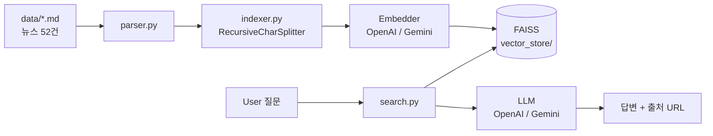

# AI-news-RAG

> 한국어 AI 뉴스 RAG 시스템 — *"내가 읽으려고 만든 AI 뉴스 비서"*


🚧 **3일 MVP 진행 중.** 평가 결과 / 완성된 사용법은 [Task 12](DASHBOARD.md) 완료 후 업데이트.

---

## 문제

매일 쏟아지는 AI 뉴스를 정독할 시간이 없음. 일반 LLM은 최신 정보에 할루시네이션 + 출처 불명확.

## 해결

옵시디언으로 수집한 한국어 AI 뉴스 마크다운(MVP: 52건)을 RAG로 검색·요약. **답변에 원본 URL 인용 필수**, 환각 방지.

## 차별점

- **OpenAI vs Gemini 동일 파이프라인 비교** — 정확도 + Latency + 비용 + Context Noise + Citation Quality
- **Provider 추상화** 설계 — 모델 갈아끼우기 한 줄
- **Engineering Decisions (ADR)** — 모든 결정에 배경/임팩트/대안비교/동작원리/사이드이펙트 5요소 근거 기록 → [`docs/decisions/`](docs/decisions/)

## 아키텍처



## 기술스택

Python 3.11 / LangChain / FAISS / OpenAI + Google Gemini / pytest

선택 근거 → [ADR 001: tech-stack](docs/decisions/001-tech-stack.md)

## 시작하기

```bash
# 1. 의존성 설치
python3.11 -m venv .venv && source .venv/bin/activate
pip install -r requirements.txt

# 2. API 키 설정 (실제 키는 .env에)
cp .env.example .env
# .env 열어 OPENAI_API_KEY, GOOGLE_API_KEY 입력

# 3. 데이터 준비 (저작권상 별도 수집 필요)
# data/*.md 옵시디언 AItimes 클립 → 자세한 건 data/README.md

# 4. 인덱싱 (Task 06 완료 후)
python -m src.indexer

# 5. 챗봇 (Task 09 완료 후)
python main.py chat

# 테스트
pytest tests/ -v
```

## 진행 상태

- [작업 대시보드 (DASHBOARD.md)](DASHBOARD.md) — 12개 Task 진행 현황
- [Engineering Decisions (ADR)](docs/decisions/) — 5요소 의사결정 기록
- [v2 백로그](docs/decisions/v2-backlog.md) — MVP 이후 Semantic Chunking / Parent-Child Retriever / GraphRAG / Strategy Pattern 등

## 데이터

`data/*.md`는 외부 뉴스 매체 저작물이라 git에 포함되지 않음 (`.gitignore`). 자세한 건 [data/README.md](data/README.md).

## License

코드: MIT (예정) / 데이터: 원 저작권자
